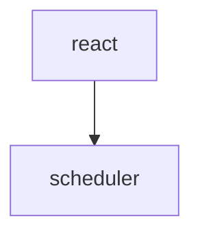

# Step 12 — Saving diagrams (sessions **and** wiki pages)

> Answers the review question: *"how implement save diagrams from session route
> in my code base?"*

## TL;DR

The rendered `<svg>` is a dead end (no Mermaid source in the DOM). But the
**Mermaid source is in the data layer** for both routes, verified live on this
codebase's target site:

- **Session route** (`api.devin.ai/ada/query/{queryId}`): the assistant answer is
  streamed as `type:'chunk'` items whose `data` is **Markdown**. When an answer
  contains a diagram it appears as a fenced ```` ```mermaid ```` block in that
  Markdown. So diagrams are saved automatically **iff we store the chunk Markdown
  verbatim** (don't strip fenced blocks).
- **Wiki route** (Next.js page): the full page Markdown — including ```` ```mermaid ````
  blocks — is in the RSC payload `window.__next_f`. Verified: 12 mermaid blocks /
  42 code fences on `/facebook/react/1.1-...`. Prefer extracting that Markdown
  over DOM→Turndown.

Mermaid fences render natively on GitHub and many Markdown viewers, so preserving
the source *is* "saving the diagram."

---

## 1. Session route — `src/api/deepwikiApi.ts`

### What the API returns (verified)

```jsonc
// GET https://api.devin.ai/ada/query/{queryId}
{
  "title": "...",
  "queries": [
    {
      "user_query": "...",
      "repo_names": ["facebook/react"],
      "response": [
        { "type": "chunk", "data": "…markdown…" },   // ← answer text (may contain ```mermaid)
        { "type": "reference", "data": { /* citation */ } },
        { "type": "file_contents", "data": { /* code */ } },
        { "type": "done" }
        // also: module_call_id, loading_indexes, stats
      ]
    }
  ]
}
```

The answer Markdown is the concatenation of every `response` item with
`type === 'chunk'`. Diagrams live **inside** that Markdown as:

````md

````

### Fix: preserve fenced blocks when transforming

In the function that turns the API `response` array into the assistant message
content (in `deepwikiApi.ts`), make sure you:

1. Concatenate `chunk` `data` **in order**, verbatim.
2. Do **not** run a normalizer that collapses/strips code fences or indented
   blocks. `normalizeText` only trims blank runs — that's fine — but avoid any
   regex that removes ``` blocks or rewrites whitespace inside them.

```ts
// inside deepwikiApi.ts — assembling the assistant answer
function extractAnswerMarkdown(response: Array<{ type: string; data: unknown }>): string {
  return response
    .filter((item) => item.type === 'chunk' && typeof item.data === 'string')
    .map((item) => item.data as string)
    .join('');
  // NOTE: returned as-is so fenced ```mermaid blocks survive into storage.
}
```

3. (Optional) Tag diagram presence for the UI:

```ts
const hasDiagram = /```mermaid/.test(answerMarkdown);
// store on message.metadata, e.g. metadata.hasDiagram = hasDiagram
```

### Why the DOM fallback can't do this

`deepwikiDomParser.ts` reads rendered text, where diagrams are already SVG — the
source is gone. So for diagram fidelity, **API capture must win over DOM
capture** (it already does in the capture flow: API capture overwrites the DOM
snapshot). No change needed there beyond preserving the Markdown above.

### Result

When the user exports a session as Markdown
(`formatConversationAsMarkdown`), the ```` ```mermaid ```` blocks are already in
`message.content` and pass straight through — GitHub renders them as diagrams.

---

## 2. Wiki route — extract Markdown from RSC (preferred over Turndown)

The wiki page ships its source Markdown in the streamed RSC array
`window.__next_f` (array of `[tag, string]` chunks). Extract it directly instead
of converting the rendered DOM — higher fidelity, diagrams included.

> ⚠️ **Isolation‑world blocker (from review, confirmed by Chrome docs):** a
> normal content script runs in an **isolated world** and *cannot* read the
> page's `window.__next_f`. We need a tiny **`world: "MAIN"` probe** that reads it
> and hands it to the isolated content script via `window.postMessage`. Without
> this, the RSC path silently fails and we fall back to lossy DOM/Turndown.

### 2a. MAIN‑world probe — `src/content/pageWorldProbe.ts` (new, bundled to `pageWorldProbe.js`)

```ts
// Runs in the PAGE's JS world (world: "MAIN"). No chrome.* APIs here.
(() => {
  function readRsc(): string | null {
    const f = (window as unknown as { __next_f?: unknown[] }).__next_f;
    if (!Array.isArray(f)) return null;
    return f
      .map((x) => (Array.isArray(x) ? x[1] : x))
      .filter((v): v is string => typeof v === 'string')
      .join('');
  }

  function post() {
    const raw = readRsc();
    if (raw) {
      window.postMessage({ source: 'wikeep-rsc', url: location.href, raw }, location.origin);
    }
  }

  // RSC streams in; post now and on DOM growth (debounced).
  post();
  let t: number | undefined;
  new MutationObserver(() => {
    if (t) clearTimeout(t);
    t = window.setTimeout(post, 500);
  }).observe(document.documentElement, { childList: true, subtree: true });

  window.addEventListener('message', (e) => {
    if (e.source === window && (e.data as { source?: string })?.source === 'wikeep-rsc-request') post();
  });
})();
```

### 2b. Isolated content script receives it

In `initWikiPageMode()` (Step 6), listen for the probe's messages and cache the
latest raw RSC for the current URL:

```ts
let latestRscRaw: { url: string; raw: string } | null = null;

window.addEventListener('message', (e: MessageEvent) => {
  if (e.source !== window) return;
  const data = e.data as { source?: string; url?: string; raw?: string };
  if (data?.source === 'wikeep-rsc' && data.url && data.raw) {
    latestRscRaw = { url: data.url, raw: data.raw };
  }
});

// when building a snapshot, prefer RSC markdown for the current URL:
function rscMarkdownForCurrent(): string | null {
  if (latestRscRaw?.url !== location.href) {
    window.postMessage({ source: 'wikeep-rsc-request' }, location.origin); // nudge probe
    return null;
  }
  return extractWikiMarkdownFromRsc(latestRscRaw.raw);
}
```

### 2c. The extractor — `src/parser/deepwikiRscSource.ts` (new)

Now a pure function over the **raw string** (no `window` access), so it is unit
testable in jsdom with a fixture:

```ts
/**
 * Best-effort recovery of a wiki page's source Markdown from the raw RSC string
 * (joined `__next_f` chunks, delivered by the MAIN-world probe).
 * Returns null if not found (caller falls back to DOM→Turndown).
 */
export function extractWikiMarkdownFromRsc(joined: string): string | null {
  if (!joined) return null;

  // The page body is a large markdown string embedded as a JSON string value.
  // Heuristic: find the longest run that looks like the article markdown
  // (starts at a top heading, contains fenced code, ends before trailing JSON).
  // RSC encodes it as a JSON string, so unescape \n and \" first if present.
  const unescaped = joined
    .replace(/\\n/g, '\n')
    .replace(/\\"/g, '"')
    .replace(/\\t/g, '\t');

  // Grab from the first H1/H2 that matches the document title region to the
  // last fenced block. Tune the anchors to the real payload (see fixture).
  const startIdx = unescaped.search(/(^|\n)#{1,2} \S/);
  if (startIdx === -1) return null;

  const body = unescaped.slice(startIdx);
  // Trim obvious trailing RSC/JSON noise after the last fence or paragraph.
  const lastFence = body.lastIndexOf('```');
  const end = lastFence !== -1 ? body.indexOf('\n', lastFence + 3) : body.length;
  const md = body.slice(0, end === -1 ? body.length : end).trim();

  // Sanity: must contain at least one heading and be substantial.
  return /#{1,3} /.test(md) && md.length > 200 ? md : null;
}
```

Wire it into the wiki parser (Step 4) as the **primary** source, with the
DOM/Turndown path as fallback. Pass the raw RSC string the content script
received from the probe (Step 12 §2b):

```ts
// signature gains an optional rscRaw arg:
export function parseWikiPage(document: Document, url: string, rscRaw?: string | null): WikiPageSnapshot | null {
  // …existing parts/root checks…
  import { extractWikiMarkdownFromRsc } from './deepwikiRscSource';

  const rscMarkdown = rscRaw ? extractWikiMarkdownFromRsc(rscRaw) : null;
  const sanitized = sanitizeForMarkdown(root);                 // still needed for contentHash + fallback
  const markdown = rscMarkdown ?? elementToMarkdown(sanitized, { sourceUrl: url });
  const hasDiagrams = /```mermaid/.test(markdown) || /data-wikeep-diagram/.test(sanitized.innerHTML);
  // …set markdown + hasDiagrams on the returned snapshot…
}
```

`hasDiagrams` is already on `WikiPageSnapshot` / `WikiPage` (Step 1). The content
script calls `parseWikiPage(document, location.href, rscMarkdownForCurrent())`.

> Robustness note: RSC payload shape is undocumented and can change. Keep the DOM
> + Turndown path (Step 4) as a guaranteed fallback, and gate RSC extraction
> behind a fixture-backed test (`tests/fixtures/wiki-rsc.txt`) so a format change
> fails loudly instead of silently saving garbage.

---

## 3. Rendering / export

No special export work: emit the Markdown as-is. ```` ```mermaid ```` blocks are
rendered by GitHub, Obsidian, VS Code (with a plugin), and many viewers. For an
HTML preview later, you could bundle Mermaid.js, but that's out of scope here.

---

## 4. Optional: keep the rendered SVG too

If a user wants the exact rendered diagram (not just source), additionally store
each diagram's `<svg>` `outerHTML` and, on export, write it as a sibling `.svg`
or an embedded block. This is the Phase‑3 "inline SVG" stretch; the Mermaid
source above is the better default.

---

## Checklist

- [ ] `deepwikiApi.ts` concatenates `chunk` Markdown verbatim (fences preserved).
- [ ] (Optional) `metadata.hasDiagram` flag set when ```` ```mermaid ```` present.
- [ ] `deepwikiRscSource.ts` recovers wiki Markdown from `__next_f`, DOM fallback intact.
- [ ] Fixture test guards the RSC extractor.
- [ ] Exported Markdown contains real Mermaid blocks for diagram answers/pages.
